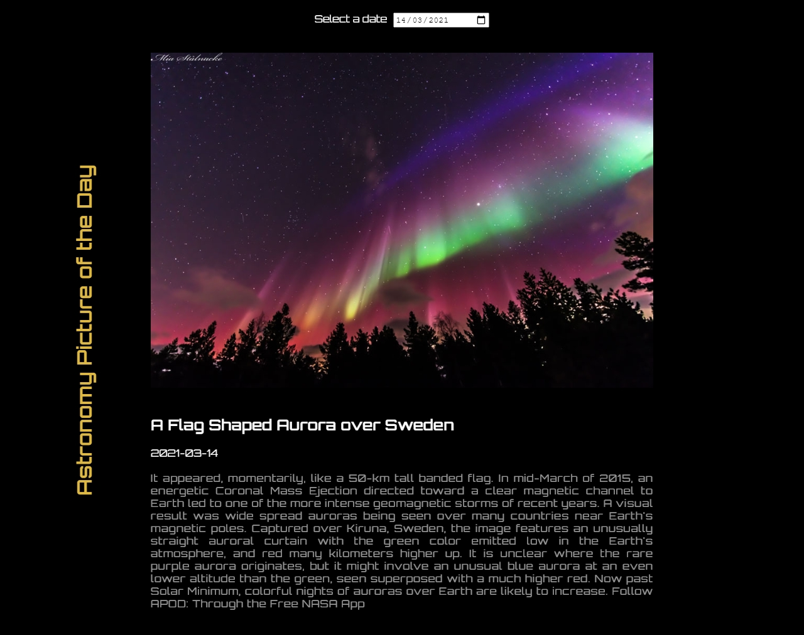

APOD APP - Astronomy Picture of the Day
 
LIVE: https://daniel-takacs.github.io/APOD-APP/
 

I built this responsive Web App with React that fetching each day different picture with brief explanation. I used React hooks like useState and useEffect. I have learnt how can use enviroment variables for hiding API key.  

